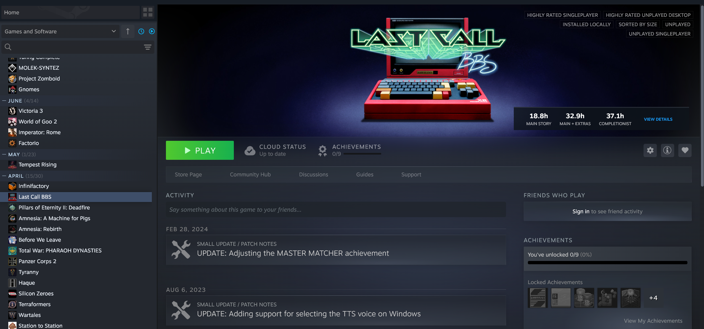
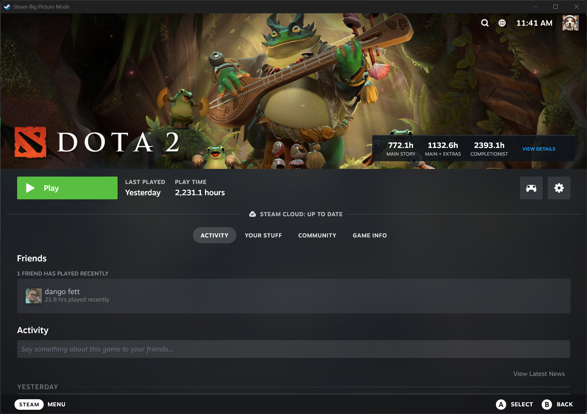

# HLTB for Steam

A [Millennium](https://steambrew.app/) plugin that displays [How Long To Beat](https://howlongtobeat.com/) completion times on game pages in the Steam library.

## Features

- Shows HLTB completion times directly on game pages:
  - Main Story
  - Main + Extras
  - Completionist
- Works in both Desktop and Big Picture modes
- Caches results locally, optionally clear via the settings page
- Click "View Details" to open the full HLTB page

## Requirements

- [Millennium](https://steambrew.app/) installed on Steam
- Windows or Linux

## Installation

1. Ensure you have Millennium installed on your Steam client
2. Navigate to HLTB from the [plugins page](https://steambrew.app/plugins)
3. Click the "Copy Plugin ID" button
4. Back in Steam, go to Steam menu > Millenium > Plugins > Install a plugin and paste the code
5. Follow the remaining instructions to install and enable the plugin

## Usage

Once installed, HLTB data automatically appears on game pages in your Steam library. Simply click on any game to see its completion times displayed on the header image.

## How It Works

On startup, if your Steam profile is public, the plugin fetches your library from HLTB's Steam import API. This provides a direct mapping from Steam app IDs to HLTB game IDs, which is more reliable than name-based search and avoids issues with mismatched game names.

When you view a game page:

1. The plugin detects the Steam App ID from the page
2. If a cached HLTB ID exists (from the Steam import), it fetches data directly by ID
3. Otherwise, it falls back to name-based search: queries Steam for the game name, applies fixes, then searches HLTB
4. Results are cached locally and displayed on the game header

If your Steam profile is private, the plugin will still work using name-based search but it may be less reliable.

## Settings

Access settings via Steam menu > Millennium Library Manger > HLTB for Steam.

- Align to Right (default = true): Position the box on the right side of the header. Disable for left side.
- Horizontal Offset (default = 0): Distance offset from the aligned edge.
- Show View Details Link (default = true): Toggle the link to the HLTB game page on or off.
- Cache Statistics / Clear Cache: View or clear locally cached HLTB data.

The position alignment and offset features are intended to avoid covering Steam UI elements like the custom game logo position "done" button.

## Known Limitations

HLTB uses name based search, and often times the name in HLTB does not match Steam. Most of the time it just works. Occasionally it does not, and so there is a [name fixes](./backend/name_fixes.lua) file. Some internal name simplification is done to handle frequent issues, but there are still some edge cases. Feel free to submit a PR for any additional name fixes.

Also note that DLC and non-game content will not have HLTB data.

## How to generate a name correction

We'll use Final Fantasy Tactics for this example.

1. Navigate to the [Steam](https://store.steampowered.com/app/1004640/FINAL_FANTASY_TACTICS__The_Ivalice_Chronicles/) or [Steam Hunters](https://steamhunters.com/apps/1004640/achievements) page
2. Note the Steam ID from the URL: `1004640`
3. Find the game in [HLTB](https://howlongtobeat.com/game/169173)
4. Note the HLTB name for the game: `Final Fantasy Tactics: The Ivalice Chronicles`

Add a line to the name_fixes.lua file like this:
`[1004640] = "Final Fantasy Tactics: The Ivalice Chronicles",`

You should add this correction to your local file and verify that it works before submitting a pull request:
`Steam/plugins/hltb-for-millennium/backend/name_fixes.lua`

## How to submit a pull request (PR) from the Github website

If you are already familiar with PRs that is great, just do your thing. For new users, you can do this process entirely from the Github website, you just need a free Github account.

When you add the name fix, it needs to be:
* in sorted order by Steam ID
* not a duplicate
* correct syntax including a comma at the end

An automated check will make sure that all of thes are true before your change can be accepted.

You **must** test it on your local copy before submitting it. I can't test it for you because I probably don't own the game. Other users can't test it for you because they are in different regions and might have other issues going on. It is very important that you test it first - see intructions in the last section.

PR instructions:
1. Fork this repo (click the "Fork" button at the top right)
2. Click "Create Fork" to make your own version of the repo - this is where you'll make your edit and then request that the main repo pulls from it
3. In your fork, navigate to the file you want to edit: `backend/name_fixes.lua`
4. Click the pencil icon to edit the file
5. Make your changes, update the commit message to something descriptive, and click "Commit changes"
6. Go back to the original repo and click "Pull requests" → "New pull request"
7. Click "compare across forks" and select your fork as the head repository
8. Click "Create pull request", add a description, and submit
9. On the pull request page make sure that all tests are passing (green) - if a test fails then you need to fix it

Official Github instructions:
* [Forking](https://docs.github.com/en/pull-requests/collaborating-with-pull-requests/working-with-forks/fork-a-repo)
* [Pull requests](https://docs.github.com/en/pull-requests/collaborating-with-pull-requests/proposing-changes-to-your-work-with-pull-requests/creating-a-pull-request).

## Development

Pull requests are welcome and appreciated! See the [development docs](./docs/README.md).

For name corrections please submit a pull request, direct submissions are not accepted. Automated tests will run and check for common problems.

Before submitting a name correction fix, please test it locally by editing: `Steam/plugins/hltb-for-millennium/backend/name_fixes.lua`. This is also the fastest way to implement a name correction - the full release process for this repository and the Millennium plugin database can take 1-2 weeks or more.

## Credits

- [HLTB for Deck](https://github.com/morwy/hltb-for-deck/) for inspiration
- [How Long To Beat](https://howlongtobeat.com/) for the game completion data
- [Millennium](https://steambrew.app/) for the plugin framework
- [HowLongToBeat-PythonAPI](https://github.com/ScrappyCocco/HowLongToBeat-PythonAPI) for HLTB API reference implementation

## Disclaimer

This plugin is not affiliated with, endorsed by, or connected to How Long To Beat or HowLongToBeat.com. All game data is sourced from their public website.

## License

MIT
